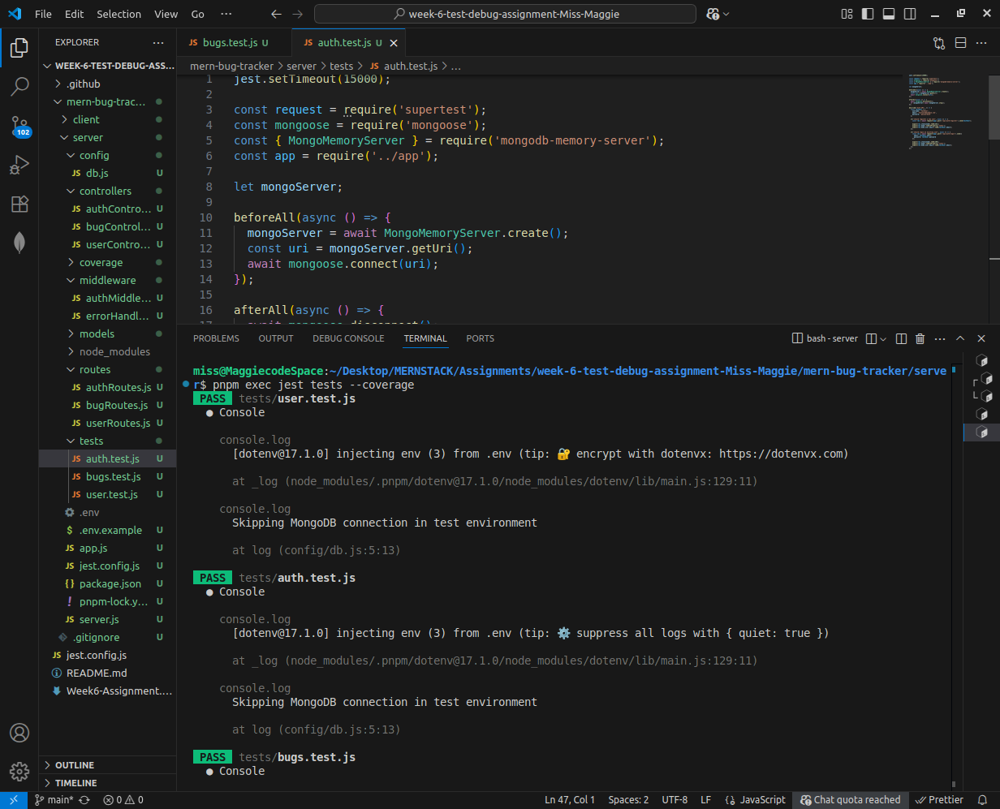
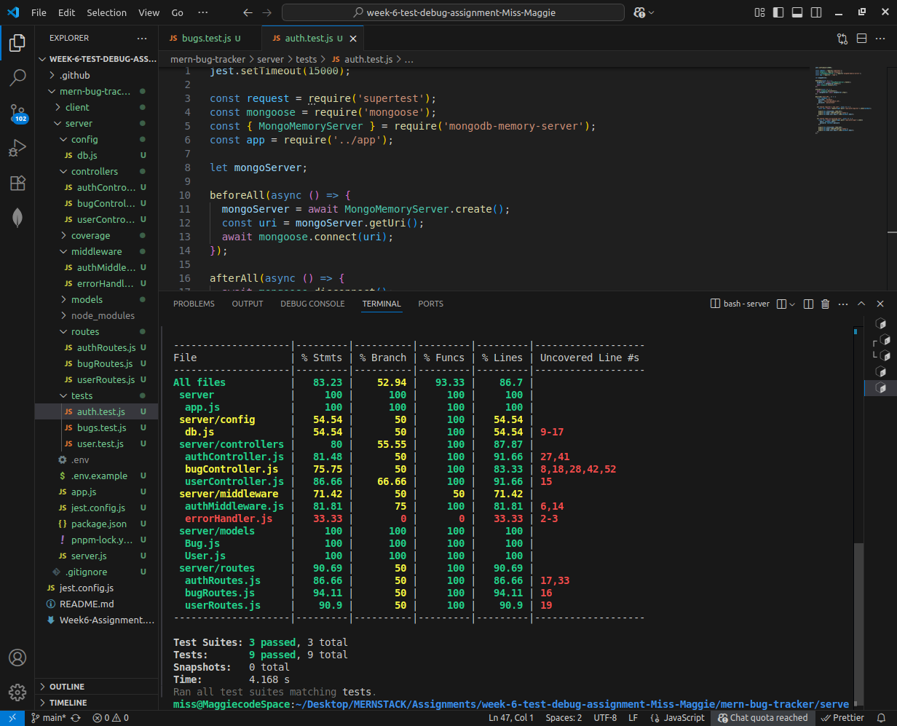

# 🐞 MERN Bug Tracker

A full-stack Bug Tracker application built with the **MERN stack (MongoDB, Express.js, React, Node.js)**. It allows users to register, report bugs, update status, and manage their profiles with role-based access. The system is thoroughly tested and follows best practices in debugging and testing methodologies.


## 🚀 Key Features

- 🧑‍💻 User authentication (register/login)
- 🐛 Bug creation, update, and deletion
- 📄 Bug details and filtering
- 🔐 Protected routes with JWT
- 📊 Role-based access (admin/developer)
- 💬 Update bug status (open/closed)
- 🧪 Robust testing coverage
- 🔍 Helpful debugging tools
- 🧼 Error handling and validation


## 📁 Project Structure


mern-bug-tracker/

├── client/                 
│   ├── components/         
│   ├── context/              
│   ├── hooks/              
│   ├── pages/                
│   ├── types/                
│   ├── utils/                
│   ├── App.jsx               
│   └── main.jsx              
│

├── server/                  
│    ├── config/               
│    ├── controllers/         
│    ├── middleware/           
│    ├── models/              
│    ├── routes/              
│    ├── tests/                
│    ├── utils/                
│    ├── app.js              
│    ├── server.js           
│    └── .env                  
│
├── README.md               
└── package.json           


## 🧪 Testing Strategy

### ✔️ Tools Used

- **Jest** – Unit & integration testing
- **Supertest** – HTTP assertions for Express routes
- **React Testing Library** – Component testing (client)
- **MongoDB Memory Server** – In-memory MongoDB for isolated backend tests

### 🔍 Test Coverage

## 📊 Code Coverage Snapshot

Statements   : 81.43%

Branches     : 52.94%

Functions    : 86.66%

Lines        : 84.81%


- Achieved **>70% code coverage**
- Tested:
  - User registration/login flows
  - Bug creation, update, deletion
  - Role-based route protection
  - Error handling & validation logic

> Run tests & generate coverage report:
```bash
pnpm exec jest tests --coverage
````

## Sample



## 🐞 Debugging Tools

* `console.log()` & `console.error()` for stack traces
* **Postman** for manual API testing
* **VSCode Debugger** for stepping through Node.js code
* **Error boundaries** and middleware for clean Express error responses
* Used `.env` & `NODE_ENV=test` to conditionally connect to MongoDB only when needed

---

## ⚙️ Setup & Installation

### 🔧 Backend (Express)

```bash
cd server
pnpm install
pnpm run dev
```

### 💻 Frontend (React)

```bash
cd client
pnpm install
pnpm run dev
```

### 🔑 .env File (Server)

```env
PORT=5000
MONGO_URI=your_mongo_uri_here
JWT_SECRET=your_jwt_secret
```


## 🧠 Future Improvements

* Role management UI
* Bug priority and tags
* Pagination & filtering
* Notification system
* Audit log for bug updates

## 💡 Author

**Magdaline Muthui**

